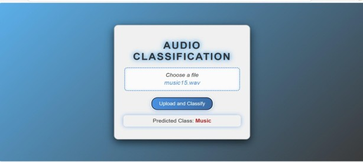
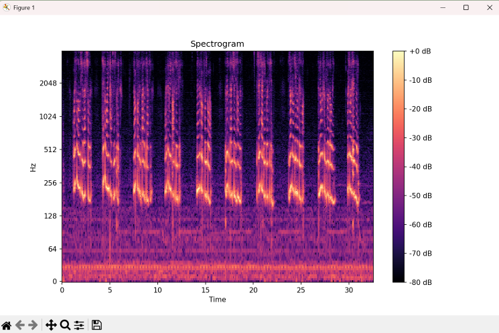
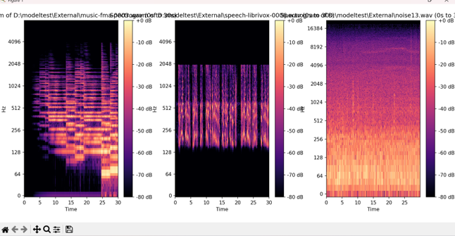
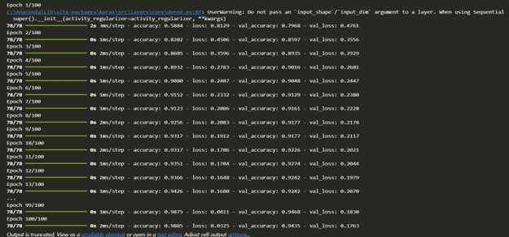

# Audio Classification System: Speech, Music, and Noise

A three-class audio classifier that labels `.wav` clips as **Speech**, **Music**, or **Noise**. It combines classical digital signal processing (band-pass/low-pass filtering, MFCCs, pitch, zero-crossing rate, RMS, energy) with a compact feed-forward neural network (MLP) trained in TensorFlow/Keras.
---


## Table of Contents

- [Overview](#overview)
- [How It Works](#how-it-works)
- [Repository Contents](#repository-contents)
- [Model Architecture](#model-architecture)
- [Feature Set](#feature-set)
- [Dataset](#dataset)
- [Installation](#installation)
- [Usage](#usage)
  - [Predicting a Single File](#predicting-a-single-file)
  - [Building a Feature Dataset from a Directory](#building-a-feature-dataset-from-a-directory)
  - [Retraining the Model](#retraining-the-model)
- [Performance](#performance)
- [Known Issues & Limitations](#known-issues--limitations)
- [Roadmap Ideas](#roadmap-ideas)
- [Authors](#authors)
- [Appendix: Full Academic Project Report](#appendix-full-academic-project-report)

---

## Overview

Given a `.wav` audio clip, the system predicts whether it is primarily **Speech**, **Music**, or **Noise**. It does this in two stages:

1. **Signal conditioning** — the raw waveform is filtered to emphasize class-relevant frequency content (see [How It Works](#how-it-works)).
2. **Feature extraction + classification** — 17 hand-engineered acoustic features are computed from the (filtered) waveform and fed into a trained MLP classifier, which outputs class probabilities.

There is no audio storage or streaming involved — the pipeline operates on individual `.wav` files provided as input.

## How It Works

```
 .wav file
    │
    ▼
┌─────────────────────────────┐
│ Band-pass filter             │  main.py: process_wav_to_memory()
│ (Butterworth, order 5,       │  scipy.signal.butter / lfilter
│  100–12,000 Hz)               │
└─────────────────────────────┘
    │  filtered signal (in-memory WAV buffer)
    ▼
┌─────────────────────────────┐
│ Feature extraction           │  main.py: extract_audio_features()
│  • Pitch (piptrack)          │  librosa
│  • Zero Crossing Rate        │
│  • RMS                       │
│  • Energy                    │
│  • 13 MFCCs                  │
└─────────────────────────────┘
    │  17-dim feature vector
    ▼
┌─────────────────────────────┐
│ StandardScaler.transform()   │  scaler.pkl
└─────────────────────────────┘
    │
    ▼
┌─────────────────────────────┐
│ MLP model (Keras)            │  sound_classifier_mlp.h5
│ Dense(128)→Dropout→Dense(64) │
│ →Dropout→Dense(3, softmax)   │
└─────────────────────────────┘
    │  argmax over 3 class probabilities
    ▼
┌─────────────────────────────┐
│ LabelEncoder.inverse_transform│  label_encoder.pkl
└─────────────────────────────┘
    │
    ▼
"Speech" | "Music" | "Noise"
```

During **offline dataset preparation** (used to build the training CSVs, not part of the live inference path above), a separate MATLAB script — described in the project report but not included as source in this repository — applied class-specific filtering before feature extraction:

| Class  | Preprocessing applied (MATLAB, offline dataset prep) |
|--------|--------------------------------------------------------|
| Speech | Band-pass filter, 500–6000 Hz (human vocal range) |
| Music  | Low-pass filter, cutoff 12,000 Hz |
| Noise  | No filtering |

All signals were additionally converted to mono and amplitude-normalized before feature extraction.

## Repository Contents

| File | Description |
|------|-------------|
| `main.py` | Inference entry point and feature-extraction utilities. Loads the trained model/scaler/encoder, filters and featurizes an input `.wav`, and prints the predicted class. Also contains `process_directory()`, the batch utility used to build the feature CSVs from a folder of `.wav` files. |
| `Model.ipynb` | Jupyter notebook that loads `combined.csv`, scales/encodes the data, builds and trains the MLP, evaluates it, and serializes the three model artifacts below. Already executed, with training/evaluation output retained in the notebook. |
| `sound_classifier_mlp.h5` | Trained Keras model (HDF5 format) — the MLP classifier. |
| `scaler.pkl` | Pickled `sklearn.preprocessing.StandardScaler`, fit on the training feature set. Required to scale features identically at inference time. |
| `label_encoder.pkl` | Pickled `sklearn.preprocessing.LabelEncoder` mapping class names (`Music`, `Noise`, `Speech`) to integer indices and back. |
| `combined.csv` | The feature dataset actually used for training — 3,100 rows (1,317 Music, 930 Noise, 852 Speech), 17 feature columns plus `Label` and `File Name`. |
| `output.csv` | An earlier/partial feature extraction run (1,087 rows, Music + Speech only). Kept for reference; not used by the notebook. |
| `output_features.csv` | An alternate feature extraction run (2,014 rows, all 3 classes) with numeric values that differ from `combined.csv` for the same filenames — likely produced with different filtering. Kept for reference; not used by the notebook. |
| `Project Report.docx`, `SNS Project Report.docx` | The original academic project report (identical content; reproduced in full in the [Appendix](#appendix-full-academic-project-report) below), including spectrogram screenshots not reproducible in markdown. |

> **Note:** the project report describes a Flask-based web GUI that was built and demoed for the course submission. **Its source code is not present in this repository or git history** — only a written workflow description and screenshots exist inside the `.docx` reports. Per the report, the intended workflow was:
> 1. User uploads a `.wav` file and presses **Classify**.
> 2. The app preprocesses the file and generates its spectrogram (`librosa`/`matplotlib`).
> 3. Features are extracted and passed through the trained MLP to predict Speech/Music/Noise.
> 4. The result is shown alongside reference spectrograms for Music, Speech, and Noise so the prediction can be visually corroborated.
>
> See the [Appendix](#appendix-full-academic-project-report) for the full academic report, including this GUI description in detail. If you want the GUI, it needs to be rebuilt from scratch or recovered from another source.

## Model Architecture

A simple feed-forward Multilayer Perceptron, defined in `Model.ipynb`:

```python
model = Sequential([
    Dense(128, activation='relu', input_shape=(17,)),
    Dropout(0.3),
    Dense(64, activation='relu'),
    Dropout(0.3),
    Dense(3, activation='softmax'),
])
model.compile(optimizer='adam', loss='categorical_crossentropy', metrics=['accuracy'])
model.fit(X_train, y_train, validation_data=(X_test, y_test), epochs=100, batch_size=32)
```

| Property | Value |
|---|---|
| Input | 17-dimensional standardized feature vector |
| Hidden layers | Dense(128, ReLU) → Dropout(0.3) → Dense(64, ReLU) → Dropout(0.3) |
| Output | Dense(3, Softmax) |
| Optimizer | Adam |
| Loss | Categorical cross-entropy |
| Epochs | 100 |
| Batch size | 32 |
| Train/test split | 80/20 (`random_state=42`) |

## Feature Set

Each `.wav` file is reduced to a 17-dimensional feature vector via `librosa`:

| Feature | Count | Purpose |
|---|---|---|
| Pitch | 1 | Mean `librosa.core.piptrack` magnitude — flags melodic/tonal content typical of music and voiced speech. |
| Zero Crossing Rate (ZCR) | 1 | Distinguishes voiced speech (low ZCR) from noisy/percussive signals (high ZCR). |
| RMS | 1 | Root-mean-square amplitude — signal power. |
| Energy | 1 | Mean squared amplitude (`sum(y²)/len(y)`). |
| MFCC_1 … MFCC_13 | 13 | Mel-Frequency Cepstral Coefficients — capture the spectral envelope / timbre of the signal. |
| **Total** | **17** | |

All features are mean-pooled across time frames, then standardized with a fitted `StandardScaler` before being passed to the model.




## Dataset

Trained and evaluated on the public **MUSAN** (Music, Speech, And Noise) corpus, roughly 2,000 samples split across the three classes. The raw MUSAN audio is **not** included in this repository — only the extracted feature CSVs (`combined.csv` etc.) are committed. Filenames follow MUSAN's convention (e.g. `music-fma-0000.wav`, where `fma` denotes the Free Music Archive subset).

Class distribution in `combined.csv` (the training set):

| Class | Rows |
|---|---|
| Music | 1,317 |
| Noise | 930 |
| Speech | 852 |

## Installation

No dependency manifest is included in the repo, so install the required packages manually:

```bash
pip install tensorflow scikit-learn librosa soundfile pandas numpy scipy
```

Recommended: use a virtual environment (`venv` or `conda`) with Python 3.9–3.11, since `librosa`/`tensorflow` compatibility can be sensitive to Python version.

```bash
python -m venv venv
venv\Scripts\activate        # Windows
pip install tensorflow scikit-learn librosa soundfile pandas numpy scipy
```

The pretrained artifacts (`sound_classifier_mlp.h5`, `scaler.pkl`, `label_encoder.pkl`) are already checked into the repo, so no training is required to run predictions.

## Usage

### Predicting a Single File

```bash
python main.py path/to/audio.wav
```

This will:
1. Load `sound_classifier_mlp.h5`, `scaler.pkl`, and `label_encoder.pkl` from the current directory.
2. Band-pass filter the input audio (100–12,000 Hz).
3. Extract the 17-feature vector.
4. Scale, predict, and print the resulting class (`Speech`, `Music`, or `Noise`).

If no file path is given, the script falls back to a hardcoded `example.wav`, which is **not included** in this repo — you must supply a real path as the first CLI argument.

### Building a Feature Dataset from a Directory

`main.py` includes `process_directory()`, used to (re)generate a CSV like `combined.csv` from a folder of `.wav` files whose filenames contain `speech`, `music`, or `noise` (case-insensitive) to auto-label them:

```python
from main import process_directory
process_directory("path/to/wav_folder", "output.csv")
```

This is not wired to a CLI flag — call it from a Python shell or a small script.

### Retraining the Model

Open `Model.ipynb` and run all cells. It expects `combined.csv` in the working directory and will regenerate:
- `sound_classifier_mlp.h5`
- `scaler.pkl`
- `label_encoder.pkl`

Hyperparameters (epochs, batch size, layer sizes, dropout rate, train/test split) are hardcoded in the notebook cells — edit them directly to experiment.

## Performance

From the notebook's final evaluation on the 20% held-out test split:

| Metric | Value |
|---|---|
| Training accuracy | 98.85% |
| Test accuracy | 94.35% |



## Known Issues & Limitations

- **Hardcoded sample rate in filtering**: `process_wav_to_memory()` in `main.py` calls the band-pass filter with `fs=48000` regardless of the audio file's actual sample rate (obtained via `librosa.load(..., sr=None)`). For files not sampled at 48 kHz, this produces an incorrectly scaled filter and degraded predictions.
- **No dependency manifest**: there is no `requirements.txt`/`pyproject.toml`, so exact library versions used to train the shipped model are unknown; a fresh environment could behave slightly differently (e.g. Keras 3.x layer API warnings observed in the notebook output).
- **Missing Flask GUI source**: the report/README historically referenced a web UI for upload + spectrogram comparison; its source was never committed.
- **Redundant/inconsistent CSVs**: `output.csv` and `output_features.csv` contain different feature values for overlapping filenames compared to `combined.csv`, likely from different filtering runs. Only `combined.csv` is used for training — the other two are left over from earlier extraction passes.
- **No automated tests or CI.**
- **No license file** — usage/redistribution terms are undefined.
- **Cosmetic bug**: in `main.py`'s `__main__` block, `wav_file_path` is reassigned to the in-memory filtered buffer before being used in the final print statement, so the printed message shows a `BytesIO` object repr rather than the original file path.

## Roadmap Ideas

- Fix the hardcoded `fs=48000` bug by passing the actual sample rate returned by `librosa.load`.
- Add a `requirements.txt`/`pyproject.toml` pinning tested versions.
- Add a CLI flag or wrapper script for `process_directory()`.
- Rebuild and commit the Flask GUI (or a lightweight Streamlit/Gradio alternative) for interactive predictions and spectrogram visualization.
- Add unit tests around feature extraction and the prediction pipeline.
- Consolidate or remove the redundant `output.csv` / `output_features.csv` artifacts.

## Authors

- Muhammad Mussa Kazim
- Bazil bin Aamir
- Muhammad Taha
- Talha Iftikhar

Department of Computer & Software Engineering, National University of Sciences and Technology (NUST) — "Signals and Systems" course project, December 2024.

---

## Appendix: Full Academic Project Report

> Reproduced from the original submission (`Project Report.docx` / `SNS Project Report.docx`), Department of Computer & Software Engineering, College of E&ME, NUST, Rawalpindi.

**Subject:** Signals and Systems
**Submitted to:** Ma'am Aleena, Sir Furqan
**Submitted by:** Muhammad Mussa Kazim (Reg# 404047), Bazil bin Aamir (Reg# 432243), Muhammad Taha (Reg# 417609), Talha Iftikhar (Reg# 410998)
**Section:** DE-44, Department C&SE – Syn B
**Submission date:** 31 December 2024

### Project Overview

This project involved developing a system to differentiate between various types of sound using signal processing techniques. Algorithms were implemented to classify audio signals into distinct categories — **speech**, **music**, and **noise** — using neural networks. The project provided foundational experience in signal processing, including filtering, pitch detection, and time- and frequency-domain analysis.

### Project Objectives

- **Understand sound signals** and their frequency/time-domain characteristics.
- **Signal preprocessing** — apply filtering and data-conditioning techniques to prepare voice, music, and noise signals for classification via pitch detection and spectral information.
- **Pitch detection** — implement algorithms to accurately detect pitch as a discriminating feature.
- **Audio classification** — classify sounds into three broad categories:
  - Speech
  - Music
  - Noise

### Tools and Resources

**Software:**
- Python (NumPy, SciPy, TensorFlow, Librosa, scikit-learn, pandas) for signal processing, feature extraction, and model training/inference.
- MATLAB for offline preprocessing of the raw dataset.

**Dataset:**
- The [MUSAN](https://www.openslr.org/17/) (Music, Speech, And Noise) corpus — a publicly available dataset with roughly 2,000 audio samples spanning human speech, music, and noise recordings — used for both model training and testing.

### Data Collection

The publicly available MUSAN dataset (~2,000 audio samples across speech, music, and noise) was used for model training and testing in Python.

### Preprocessing (MATLAB)

The MUSAN dataset was first preprocessed in MATLAB to remove background artifacts and emphasize class-relevant frequency content, before being handed off to the Python feature-extraction stage:

| Class | Filter Applied | Rationale |
|---|---|---|
| Speech | Band-pass filter, 500–6000 Hz | Human audible speech falls within this frequency range. |
| Music | Low-pass filter, cutoff 12,000 Hz | Frequencies above 12 kHz are perceptually closer to noise for human hearing. |
| Noise | No filter | Left unfiltered as the baseline/negative class. |

All filtered signals were converted to mono and amplitude-normalized, then written to a separate `_filtered` output folder, processed in batches of 50 files to manage memory.

MATLAB batch-processing code (as used for the Speech class; the same pattern was applied per class with the appropriate filter object):

```matlab
folderPath = 'C:\Downloads\musan\Speech';            % Source folder
filteredFolder = 'C:\Downloads\musan\Speech_filtered'; % Destination for filtered .wav files

if ~exist(filteredFolder, 'dir')
    mkdir(filteredFolder);
end

files = dir(fullfile(folderPath, '*.wav'));
numFiles = length(files);
batchSize = 50;

for startIdx = 1:batchSize:numFiles
    endIdx = min(startIdx + batchSize - 1, numFiles);

    for i = startIdx:endIdx
        filePath = fullfile(folderPath, files(i).name);
        fprintf('Processing file %d of %d: %s\n', i, numFiles, files(i).name);

        [audio, Fs] = audioread(filePath);

        % Apply filter (BP = band-pass filter object designed for this class)
        filteredAudio = filter(BP, audio);

        % Convert stereo to mono if necessary
        if size(filteredAudio, 2) > 1
            filteredAudio = mean(filteredAudio, 2);
        end

        % Normalize amplitude
        filteredAudio = filteredAudio / max(abs(filteredAudio));

        filteredFilePath = fullfile(filteredFolder, files(i).name);
        audiowrite(filteredFilePath, filteredAudio, Fs);
    end

    clear audio filteredAudio;
    disp(['Processed batch from ', num2str(startIdx), ' to ', num2str(endIdx)]);
end

disp('Filtering and saving complete.');
```

> This MATLAB script is documented here for completeness (as described in the original report); its source file is not included in this repository — only the resulting extracted-feature CSVs (`combined.csv`, etc.) are committed.

### Feature Extraction (Python / Librosa)

After MATLAB preprocessing, features were extracted from the filtered dataset using **Librosa**, a Python library for audio and music analysis. Five categories of features were extracted (17 scalar values total once MFCCs are expanded):

- **Pitch** — the perceived highness/lowness of a sound, determined by the fundamental frequency of the waveform. Higher frequency → higher pitch.
- **Zero Crossing Rate (ZCR)** — the rate at which the signal changes sign (positive→zero→negative or vice versa). Widely used in speech recognition and music information retrieval, and a key discriminator for percussive sounds.
- **Root Mean Square (RMS)** — represents the average power/loudness of the signal; bridges technical amplitude measurements and perceived loudness.
- **Energy** — the signal's kinetic energy, derived from the squared amplitude of air-pressure vibrations that constitute sound.
- **Mel-Frequency Cepstral Coefficients (MFCCs)** — 13 coefficients derived from a "spectrum of a spectrum" (cepstral) representation, where frequency bands are spaced on the mel scale to approximate human auditory perception more closely than a linear frequency scale. Computed by:
  1. Taking the Fourier transform of a windowed excerpt of the signal.
  2. Mapping the resulting power spectrum onto the mel scale using overlapping (triangular or cosine) windows.
  3. Taking the log of the power at each mel frequency.
  4. Taking the discrete cosine transform (DCT) of the list of mel log-powers.
  5. The resulting amplitudes are the MFCCs.

In Python, every `.wav` file in a directory is processed, features are extracted per file, and results are saved to a CSV (this is implemented as `process_directory()` / `extract_audio_features()` in [`main.py`](main.py)).

### Audio Classification (Model Training)

To classify sounds into Speech / Music / Noise, a deep learning model was trained using **TensorFlow**, with **NumPy** and **pandas** for data handling, inside a Jupyter Notebook (`Model.ipynb`).

Training pipeline:
1. Load the extracted audio feature dataset (`combined.csv`).
2. Scale all feature columns (via `StandardScaler`) so the model can learn from normalized inputs rather than raw, differently-scaled magnitudes.
3. Split the data — 80% for training, 20% held out for testing.
4. Train the model for **100 epochs**.
5. Evaluate on the training set: **98.85% training accuracy**.
6. Evaluate on the held-out test set: **94.35% test accuracy**.
7. Save the trained model (`sound_classifier_mlp.h5`), along with the fitted scaler (`scaler.pkl`) and label encoder (`label_encoder.pkl`) needed to reproduce identical preprocessing at inference time.

See [Model Architecture](#model-architecture) above for the exact Keras layer definitions.

### Graphical User Interface (Flask)

After implementing the trained model in `main.py`, the project was integrated into a **graphical user interface built with Flask** to improve the end-user experience. The GUI reports the predicted sound class and displays the spectrogram of the uploaded file.

**Flask application workflow**, as designed and demoed for the course submission:

1. **Audio file upload** — the user uploads a `.wav` file through the web interface and presses **Classify**.
2. **Audio file processing** — the uploaded file is preprocessed and converted into a spectrogram using `librosa`/`matplotlib`.
3. **Feature extraction and classification** — the underlying audio features are extracted and passed through the pre-trained MLP model to determine whether the clip is music, speech, or noise.
4. **Result visualization** — the spectrogram of the classified file is displayed side-by-side with reference spectrograms for music, speech, and noise (computed from representative test-set samples), and the predicted class label is shown clearly to the user.

### Spectrum Plotting

Reference spectrograms were generated for representative Music, Speech, and Noise files from the test data. Each spectrogram visualizes the frequency distribution of a signal over time, with color intensity representing magnitude. These reference plots serve as a visual aid: the spectrogram of a newly classified file is shown alongside them so a user can visually corroborate the model's prediction based on spectral characteristics (e.g., harmonic banding typical of music, formant structure typical of speech, or broadband energy typical of noise).

### Testing and Evaluation

After full integration of the pipeline — preprocessing, feature extraction, model inference, and the Flask GUI — the complete application was tested end-to-end and classified audio files with high accuracy, consistent with the 94.35% test accuracy measured during model evaluation.

### Report Conclusion

This project successfully implemented an audio classification system using the MUSAN dataset, categorizing audio samples into speech, music, and noise. By extracting key features — pitch, MFCCs, zero-crossing rate, energy, and RMS — the team achieved a test accuracy of approximately 94% using a simple Multilayer Perceptron (MLP) model. To further enhance the user experience, a Flask application was developed, providing an intuitive graphical interface for real-time audio classification. The project demonstrates the value of combining traditional digital signal processing techniques with machine learning to efficiently classify audio data, with the Flask application adding accessibility for interactive use.

### Implementation Status Note

This appendix preserves the original academic submission's description of the system, including the Flask GUI, MATLAB preprocessing scripts, and spectrogram comparison feature. As of this repository's current state:

- **Included and runnable:** the Python feature-extraction pipeline, the trained MLP model and its artifacts (`sound_classifier_mlp.h5`, `scaler.pkl`, `label_encoder.pkl`), the training notebook (`Model.ipynb`), and the CLI inference script (`main.py`).
- **Described but not included:** the MATLAB preprocessing script and the Flask GUI (upload, spectrogram comparison, live classification). Neither has source files present in this repository or its git history — they exist only as code excerpts and screenshots inside the original `.docx` reports.
